<!--
  src: github.com/theycelz | last-modified: 2026-08
-->


<div align="center">

<!-- Custom animated SVG header -->


<br/>

<a href="https://www.linkedin.com/in/eos-xavier-439095207/"></a>&nbsp;<a href="https://www.instagram.com/plzeos/"></a>&nbsp;

</div>

<br/>

```
$ cat /etc/motd
```

> Site Reliability Engineer at Seazone, software engineering researcher at LEDES/UFMS.
> B.Sc. Software Engineering, UFMS '25. Three papers accepted in 2026.
> I like breaking prod so I can learn how to fix it faster next time.

<br/>

<!-- BENTO GRID via HTML table -->

<table>
<tr>
<td width="50%" valign="top">

### `> systemctl status sre`

```yaml
role: site reliability engineer @ seazone
location: Campo Grande/MS, Brazil
degree: B.Sc. Software Engineering (UFMS '25)

focus:
  - aws + kubernetes/eks in production
  - ci/cd + sast gates (github actions)
  - self-service platform tooling
  - incident response & rca

research: # ledes/ufms
  - reproducible data-arch benchmarking
  - community smells in ML teams
```

</td>
<td width="50%" valign="top">

### `> cat /var/log/highlights`

```json
{
  "papers_2026": [
    { "name": "Rampart",
      "venue": "SBBD", "role": "lead author",
      "status": "accepted" },
    { "name": "PBI Grid",
      "venue": "SBES tools track",
      "status": "accepted" },
    { "name": "Branching Echoes",
      "venue": "VEM @ CBSoft",
      "status": "accepted" }
  ],
  "in_production": "pbi-grid renders a CAPES public dashboard"
}
```

</td>
</tr>
</table>

<br/>

<!-- TECH STACK BENTO CARDS -->

<div align="center">

## `> pacman -Qi toolchain`

</div>

<table>
<tr>
<td align="center" width="25%">
<br/>
<b>infrastructure</b>
<br/><br/>
<br/>

<br/><br/>
</td>
<td align="center" width="25%">
<br/>
<b>languages</b>
<br/><br/>
<br/>

<br/><br/>
</td>
<td align="center" width="25%">
<br/>
<b>observability & data</b>
<br/><br/>
<br/>

<br/><br/>
</td>
<td align="center" width="25%">
<br/>
<b>tooling</b>
<br/><br/>
<br/>

<br/><br/>
</td>
</tr>
</table>

<details>
<summary><kbd>   MORE TOOLS   </kbd></summary>
<br/>

```
╔══════════════════╦═══════════════════════════════════════════════╗
║ orchestration    ║ kubectl · ArgoCD · Helm · kubeconform         ║
╠══════════════════╬═══════════════════════════════════════════════╣
║ automation       ║ n8n (self-hosted/K8s) · AWS Lambda · boto3    ║
╠══════════════════╬═══════════════════════════════════════════════╣
║ finops           ║ AWS Cost Explorer · budgets · tagging         ║
╠══════════════════╬═══════════════════════════════════════════════╣
║ delivery         ║ GitHub Actions · SAST gates · Cloudflare      ║
╠══════════════════╬═══════════════════════════════════════════════╣
║ data             ║ DuckDB · Polars · Dask · Spark · Glue         ║
║                  ║ Athena · Pandas · PostgreSQL                  ║
╠══════════════════╬═══════════════════════════════════════════════╣
║ linux            ║ Archcraft · EndeavourOS · Omarchy             ║
╠══════════════════╬═══════════════════════════════════════════════╣
║ observability    ║ Grafana · Prometheus · Loki                   ║
╚══════════════════╩═══════════════════════════════════════════════╝
```

</details>

<br/>

<!-- GITHUB STATS -->

<div align="center">

## `> neofetch`

&nbsp;

<br/><br/>


</div>

<br/>

<!-- SNAKE ANIMATION -->

<div align="center">

## `> watch -n1 contributions`

<picture>
  <source media="(prefers-color-scheme: dark)" srcset="https://raw.githubusercontent.com/theycelz/theycelz/output/github-snake-dark.svg">
  <source media="(prefers-color-scheme: light)" srcset="https://raw.githubusercontent.com/theycelz/theycelz/output/github-snake.svg">
  
</picture>

</div>

<br/>

<!-- PROJECTS + PUBLICATIONS -->

<div align="center">

## `> ls -la ~/projects`

</div>

<table>
<tr>
<td width="50%" valign="top">

### [rampart-framework](https://github.com/DATA-UFMS/rampart-framework) 

Reproducible benchmarking of data processing paradigms (DuckDB, Polars, Dask) with automated anti-leakage verification. Bitwise-identical predictions or the pipeline fails.

`SBBD 2026 · lead author · best-short-papers session`

</td>
<td width="50%" valign="top">

### [pbi-grid](https://github.com/OESNPG/pbi-grid) 

Dashboard-as-Code for Power BI: declarative YAML compiled into PBIR by a deterministic 12-column grid engine. [Live at CAPES](https://agendanacional.capes.gov.br/capacity) · [DOI](https://doi.org/10.5281/zenodo.21462034)

`SBES 2026 · tools track · in production`

</td>
</tr>
<tr>
<td width="50%" valign="top">

### [copilot-sprint-review](https://github.com/theycelz/copilot-sprint-review) 

Experimental analysis of GitHub Copilot's impact on code review: 95% merge-time reduction, tested with Mann-Whitney U and Cohen's d.

`empirical software engineering`

</td>
<td width="50%" valign="top">

### `> cat publications.bib` 

**Rampart** · SBBD 2026 · lead author

**PBI Grid** · SBES 2026 tools track

**Branching Echoes** · VEM 2026, CBSoft · [accepted papers](https://vemworkshop.github.io/vem2026/acceptedPapers.html)

</td>
</tr>
</table>

<br/>

<!-- PROFILE SUMMARY CARDS -->

<div align="center">

<details>
<summary><kbd>   PROFILE SUMMARY   </kbd></summary>
<br/>


<br/>


<br/>


</details>

</div>

<br/>

---

<div align="center">

```
   ┌─────────────────────────────────────────────────────────┐
   │                                                         │
   │   "if it's not automated, it's not done."               │
   │                                                         │
   │                              — me, after every incident  │
   │                                                         │
   └─────────────────────────────────────────────────────────┘
```

<sub>

`uptime: since 2003` · `os: archcraft` · `shell: zsh` · `editor: nvim`

</sub>

<br/>


</div>
